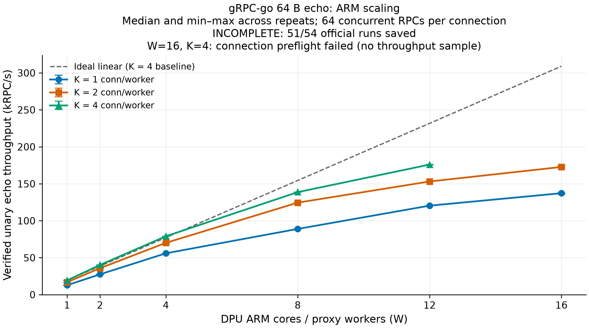
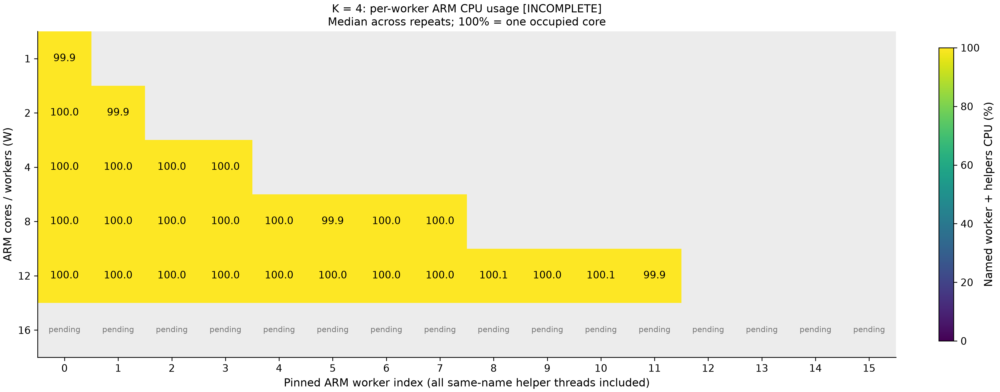

# gRPC-go 64B echo: DPU ARM core scaling — 2026-09-26

> 후속 실험: EU partition 해제 후 W16/K4가 3회 모두 성공했고 중앙값은 200,568.6 RPC/s였다. [별도 조건의 재실험 결과](2026-09-26_grpc-go-64b-w16-k4-no-eu-partitions.md). 아래 내용과 원본은 기존 partition 환경의 기록이다.

**18조건 중 17조건에서 각 3회, 총 51회의 유효 측정을 확보했다.** 공식 측정 구간 RPC는 44,067,293건이며, 유효 실행에서 payload mismatch·RPC 오류·재연결은 0건이었다. 별도 perf 진단 2회는 공식 수치에서 제외했다.

**16코어·4 conn/core는 연결 준비가 3회 실패하여 처리량을 측정하지 못했다.** 전체 계획은 54회 중 51회이며 JSON에도 `INCOMPLETE`로 표시했다. 실패 조건은 0 RPC/s로 취급하지 않았다. 모든 benchmark server와 proxy는 정리했으며 종료 후 DPA process는 0개였다.

## 처리량

`dpu-dma`, 요청/응답 64B echo, **connection마다 동시 RPC 64개**. Connection 수는 각 ARM worker의 client gRPC connection 수이며 backend pool도 같은 수로 두었다. 수치는 3회 중앙값이다.

| ARM cores | 1 conn/core (RPC/s) | 2 conn/core (RPC/s) | 4 conn/core (RPC/s) |
| --- | --- | --- | --- |
| 1 | 12,765.8 | 16,863.3 | 19,315.7 |
| 2 | 27,521.1 | 35,790.4 | 40,211.6 |
| 4 | 55,958.3 | 70,124.5 | 79,040.4 |
| 8 | 88,956.7 | 124,509.9 | 138,723.9 |
| 12 | 120,403.6 | 153,108.3 | 175,974.5 |
| 16 | 137,262.7 | 172,770.7 | N/A: preflight 실패 |

12코어·4 conn/core는 8코어보다 **26.9%** 높은 175,974.5 RPC/s다. 1코어 대비 확장 효율은 12코어에서 K=1/2/4 각각 **78.6/75.7/75.9%**, 16코어에서 K=1/2 각각 **67.2/64.0%**다. W=16에서는 host CPU도 거의 포화되므로 이 효율 저하를 ARM만의 한계로 해석하지 않는다.

## 코어별 CPU와 병목 판단

100%는 CPU 하나 전체의 사용량이다. 아래 범위는 해당 조건의 3회 실행과 모든 worker/core를 포함한다. Worker CPU는 같은 이름을 상속한 DOCA helper도 합산한다. 실제 core busy는 `/proc/stat`으로 별도 계산했다.

| ARM cores | Conn/core | 각 worker + helper CPU (%) | 각 ARM core busy (%) |
| --- | --- | --- | --- |
| 8 | 4 | 99.89–100.12 | 100.00–100.00 |
| 12 | 1 | 99.80–100.10 | 100.00–100.00 |
| 12 | 2 | 99.60–100.03 | 100.00–100.00 |
| 12 | 4 | 99.85–100.15 | 100.00–100.00 |
| 16 | 1 | 92.82–99.83 | 99.80–100.00 |
| 16 | 2 | 91.38–99.87 | 99.60–99.90 |

1~8코어의 모든 조건에서 worker/helper 사용률은 99.84–100.12%였다. 12코어도 거의 100%였지만, 16코어에서는 worker에 따라 약 91–100%다. 100%를 조금 넘는 값은 CPU tick과 marker 경계의 계측 오차다. 개별 worker별 값·affinity는 JSON에 모두 보존했다.

16코어에서는 proxy CPU 합계가 1,526.98–1,578.21%로, proxy가 16코어를 독점하지 못했다. OS·Codex·다른 작업과 코어를 공유한다. 다만 해당 공식 측정 구간의 controller CPU는 최대 한 코어의 0.30%, direct child와 mock은 0%여서, 차이 전부를 실험 controller 때문이라고 설명할 수는 없다. 별도 1초 pidstat 진단은 일부 background 작업을 확인했지만 전체 구간의 원인을 분리하는 계측은 아니다.

**CPU 100%만으로 유효 RPC 처리 연산이 포화됐다고 판정할 수 없다.** `DMESH_BUSY_POLL=1`이므로 RPC를 보내지 않고 backend만 연결한 3초 무부하 측정에서도 W=1/2/4/8/12/16의 대상 core는 모두 약 100% busy였다. Polling과 요청 처리의 CPU 비용을 구분해야 한다.

Host client/server는 각각 고정된 8개 x86 core를 공유했다. 다음은 `/proc/stat`으로 계산한 pool 전체 busy의 3회 중앙값이며, process CPU 합계/8과 구분한다.

| DPU ARM cores | Conn/core | Host client pool busy | Host server pool busy |
| --- | --- | --- | --- |
| 8 | 4 | 87.37% | 88.85% |
| 12 | 1 | 93.94% | 94.74% |
| 12 | 2 | 94.65% | 96.15% |
| 12 | 4 | 94.35% | 96.68% |
| 16 | 1 | 97.15% | 98.07% |
| 16 | 2 | 97.38% | 98.76% |

16코어에서 server pool은 K=1의 세 반복 모두 **97.91–98.08%**, K=2는 **98.69–98.91%**였다. Host CPU 예산을 늘리거나 endpoint를 분리하지 않은 이번 결과는 전체 시스템 확장성이다. ARM worker 병목 하나만을 분리해 측정한 결과는 아니다.

## 16코어·4 conn/core 초기화 실패

동일 바이너리와 pool 설정으로 다음 세 시도를 보존했다. 어느 시도에서도 공통 measurement_start에 도달하지 않았다.

| 시도 | 준비 방식 | 결과/원본 |
|---|---|---|
| 1 | K=1/2 성공 후 client 병렬 시작 | 여러 worker의 4번째 connection preflight timeout. `w16-first-session/`, `w16-k4-r1-failed-attempt1.log` |
| 2 | 새 proxy로 client 병렬 시작 | 같은 연결 준비 실패. `w16-retry2-session/`, `w16-k4-r1-failed-attempt2.log` |
| 3 | 새 proxy, client process를 순서대로 준비 | worker0~12의 각 4개 연결 성공, worker13의 3번째 연결 실패. `w16/`, `w16-k4-r1.log` |

세 번째 시도의 proxy 로그에서 `Timeout on RPC polling`, `Flexio RPC for init device params failed`, `Failed to start producer completion - DOCA_ERROR_DRIVER`를 확인했다. 실패 지점은 `src/transport/common/dpa.c:717`의 `doca_dpa_completion_start()`이다. 앞선 병렬 시도는 DPA thread 초기화/실행 경로에서도 진행이 멈췄으므로 모든 시도가 같은 API에서 실패했다고 단정하지 않는다. Client preflight deadline은 5초였고, 세 번째 시도의 DPA 초기화 오류는 약 6.27초 뒤 기록됐다.

읽기 전용 resource query 결과는 다음과 같다.

- Chip의 DPA 실행 유닛(EU)은 190개다. 여기서 DPA core/EU는 ARM core와 다른 자원이다.
- 기존 partition1은 VHCA0에 EU0–63, partition2는 VHCA37–40에 EU64–71을 할당했다. 합계 72개이며 나머지는 **118개**다.
- 시험 device `0000:03:00.1`의 VHCA는 **4**다. DOCA devinfo와 `dpaeumgmt info vhca`로 교차 확인했으며 명시된 두 partition에 속하지 않는다. 별도로 구성한 EU group은 0개다.
- 세 번째 시도에서 backend 64개 + client 54개 = **118개 active flow**까지 성공한 뒤 119번째 flow의 초기화가 멈췄다. 목표는 frontend/backend 합계 **128개 flow**다.
- 현재 구현은 DPA context를 worker마다 공유하지만 지속 polling하는 DPA thread는 flow마다 사용한다. 명시적인 thread EU affinity/group 지정은 없다. SDK는 affinity 미지정 시 사용 가능한 EU에서 실행한다고 명시하고, 초기화에 사용하는 FlexIO RPC도 EU에서 실행된다.

따라서 **잔여 118개 EU를 per-flow polling thread가 점유하면서 다음 초기화 RPC가 실행되지 못한 상황이 유력하다.** 남은 EU 수와 실패 경계가 정확히 일치한다. 다만 기본 partition의 스케줄링을 분리한 실험까지 한 것은 아니므로 원인을 확정한 것으로 기록하지 않았다. 기존 partition 및 production 코드는 변경하지 않았다. 이 결과는 ARM 처리량의 한계와 별개인 DPA 연결 초기화 제한이다.

## 반복 범위와 지연

지연 열은 각 반복에서 worker별 p99 중 최댓값을 구한 뒤 3회 중앙값을 취했다. **전체 RPC를 합친 p99가 아니다.** JSON에는 모든 worker의 평균/p50/p99가 별도로 있다. 실패 행의 connection/concurrency는 실행 목표다.

| Cores | Conn/core | 총 client conn | 총 동시 RPC | RPC/s 범위 | 최대 worker p99 중앙값 (ms) |
| --- | --- | --- | --- | --- | --- |
| 1 | 1 | 1 | 64 | 12,651.3–12,794.2 | 6.768 |
| 1 | 2 | 2 | 128 | 16,845.7–16,941.6 | 10.351 |
| 1 | 4 | 4 | 256 | 19,312.8–19,372.7 | 17.187 |
| 2 | 1 | 2 | 128 | 27,507.6–27,684.3 | 6.716 |
| 2 | 2 | 4 | 256 | 35,692.2–35,891.5 | 10.218 |
| 2 | 4 | 8 | 512 | 40,191.6–40,281.5 | 17.073 |
| 4 | 1 | 4 | 256 | 55,686.7–56,010.9 | 7.796 |
| 4 | 2 | 8 | 512 | 69,839.8–70,154.7 | 12.033 |
| 4 | 4 | 16 | 1024 | 78,948.8–79,137.3 | 17.552 |
| 8 | 1 | 8 | 512 | 88,950.2–89,010.2 | 11.908 |
| 8 | 2 | 16 | 1024 | 124,381.8–124,608.2 | 15.924 |
| 8 | 4 | 32 | 2048 | 138,443.7–138,823.1 | 24.472 |
| 12 | 1 | 12 | 768 | 120,288.4–120,447.7 | 14.675 |
| 12 | 2 | 24 | 1536 | 153,068.8–153,524.6 | 21.835 |
| 12 | 4 | 48 | 3072 | 175,521.3–176,050.9 | 35.141 |
| 16 | 1 | 16 | 1024 | 136,237.7–137,484.9 | 25.484 |
| 16 | 2 | 32 | 2048 | 171,478.1–174,163.1 | 39.658 |
| 16 | 4 | 64 | 4096 | N/A: preflight 실패 | N/A |

## 재현 조건

- 요청과 응답 각각 64B application payload, gRPC-go unary raw-codec echo. HTTP/2와 gRPC framing은 별도이며 protobuf 직렬화와 POSIX preload는 사용하지 않았다.
- DPU: BlueField-3 Cortex-A78AE 16 cores. W=1/2/4/8/12/16에 CPU15,14–15,12–15,8–15,4–15,0–15를 사용. `DMESH_SHARDED=1`, `DMESH_NUM_WORKERS=W`, `LINKERD2_PROXY_CORES=1`, `DMESH_BUSY_POLL=1`.
- 현재 Go API는 process당 channel 하나를 특정 Comch worker에 연결한다. W개 client process와 W개 server process를 두고 각각 `DPUMESH_SERVER=DPUMesh{i}`로 지정했다. 각 process의 연결은 1/2/4개다.
- Worker별 고유 service `10.0.1.(i+1):8086`, 이름 `bench-echo-i`, ID `i+2`를 사용했다. 이는 global backend registry에서 서로 다른 worker의 backend가 섞이지 않게 한다. Backend initial pool/max 모두 K로 고정했다.
- Host는 동일 x86 jet1 한 대. 모든 client process가 CPU0–7, 모든 server process가 CPU8–15를 공유하며 process마다 GOMAXPROCS=8이다. Host CPU 예산은 W와 관계없이 8+8 cores다.
- Native library, DPA kernel 및 proxy 바이너리는 직전 측정과 같다. Proxy release는 ThinLTO/codegen-units=16이다. Fixture에 시작 시각 동기화만 추가하고 새 이름 `channel-bench-scale`로 빌드했다. 기존 benchmark 바이너리는 보존했다.
- `-connections K -concurrency 64K -warmup 3s -duration 10s -rpc-timeout 5s -start-file PATH`. 모든 client가 preflight와 worker 준비를 마친 뒤 controller가 동일 미래 RFC3339Nano 시각을 atomic rename으로 게시했다. 모든 worker의 measurement_start/end가 정확히 같음을 검증했다.
- 측정 구간에 완료된 RPC 수/10초를 worker별로 구해 합산한다. Warmup/drain은 제외한다. 모든 응답을 검증하고 native dial은 connection당 정확히 1회여야 통과한다.
- 성공한 각 조건은 client 새 process로 3회 반복하며 server는 세 반복 동안 유지했다. 조건별 server를 종료하고 pool 크기를 변경했다. 정상 teardown을 우회하지 않았다.
- Mock control plane과 DPU 실험 controller/profiler는 CPU0–3에 고정했다. W=16은 proxy와 controller/mock의 CPU가 겹치며 OS와 다른 작업용 코어도 남지 않는다. Proxy worker i와 해당 helper의 affinity는 CPU15−i다. DPA hardware 연산은 ARM core 수에 포함하지 않는다.
- DPA context는 worker마다 하나지만 모두 같은 physical device를 사용한다. Thread 객체는 32W개를 미리 생성하고 실제 flow의 active thread는 client+backend 합계 2KW개다. W8/K4는 64개, W12/K4는 96개 active flow이며 W16/K4는 128개를 요구한다. 구현은 여전히 per-flow DPA thread이며 DPA EU의 worker별 분할은 설정하지 않았다. DMA/PCIe 역시 공유한다.

## 계측과 검증 한계

- START/END마다 `/proc/PID/task/TID/stat`, thread 이름/affinity, `/proc/stat` 및 host client/server CPU를 기록했다. 유효 실행 모두 worker affinity, native dial 1회/connection 및 동일한 10초 측정 구간을 검증했다. 관측된 CPU steal은 0이었다.
- `kernel.sched_schedstats=0`이어서 runqueue wait는 사용할 수 없다. JSON의 null을 0으로 해석하지 않는다.
- 공식 측정에는 perf를 실행하지 않았다. W1/K4와 W8/K4에서만 별도 진단했다. 부하 perf는 측정 구간 내 8초, idle perf는 4초, `cycles:u` 199Hz와 DWARF stack 및 perf stat을 사용했다. 12/16코어의 perf 결과는 없다.
- 무부하에서는 session/connection 상태 확인, DOCA polling, 시간 조회와 runtime 루프가, 부하에서는 h2 프레임·스트림 처리, 할당, Bytes 참조 관리, Tokio 실행 등이 나타났다. Unknown symbol이 있어 정확한 polling 낭비 비율을 산출하지 않았다. IPC는 W1 idle/load 2.20/1.06, W8 2.33/1.09였으며 lost samples는 0이다.
- 원래 worker별 perf report의 0.5% 표시 임계값은 낮은 항목을 숨기므로, 모든 worker를 합치고 표시 임계값을 0으로 둔 `.aggregate.txt`도 사용했다. Perf 구간이 RPC 10초 구간과 달라 정확한 cycles/RPC는 계산하지 않았다.
- 초기 readiness 검사에서 helper의 worker 이름 상속을 처리하도록 수정했고 `/proc` 종료 race 처리도 보강했다. W1/K1·K2 성공 후 perf inline symbol 해석 지연으로 분석을 중단했으나 결과를 보존했고 `--no-inline`으로 전환해 계속했다. 이 준비/분석 문제와 이번 W16/K4의 transport 초기화 실패를 구분한다.
- 시작 시각 fixture의 `go test -race ./cmd/channel-bench`가 통과했다. Timestamp 비교 테스트의 monotonic anchor 1ns 차이 허용을 수정한 뒤 검사를 통과했다. 이 scaling 실험에서 production transport/proxy 코드는 수정하지 않았다.

## 자료

- JSON: 원본·검증·집계·실패 메타데이터: `bench-results/2026-09-26_grpc-go-64b-arm-scaling.json`
- [반복별 CSV](2026-09-26_grpc-go-64b-arm-scaling.csv)
- [처리량 PNG](2026-09-26_grpc-go-64b-arm-scaling-throughput.png)
- [코어별 CPU PNG](2026-09-26_grpc-go-64b-arm-scaling-worker-cpu-k4.png)
- 원본: `/tmp/dmesh-grpc-scale-20260926/`. `results.json`, `failures.json`, `w*-k*-r*.log`, host client/server 로그·exit, 각 세션의 `stop-result.json`, perf 원본을 보존했다.
- W12는 `w12/`, W16의 성공한 K1/K2 및 첫 실패는 `w16-first-session/`, 두 번째 실패는 `w16-retry2-session/`, 세 번째 실패는 `w16/`에 있다. 각각 `host/w16-k4-failed-attempt1/`, `host/w16-k4-failed-attempt2/`, `host/w16-k4/`에 실패 client/server 로그가 있다.
- 읽기 전용 자원 확인: `dpa-chip-info.txt`, `dpa-partitions-after.txt`, `dpa-device-vhca.txt`, `dpa-vhca-after.txt`, `dpa-eu-groups-after.txt`, `dpa-status-after.txt`. 마지막 status의 processes=0이다.
- 실패 proxy 로그와 자원 확인 출력 사본은 보고서 옆 `2026-09-26_grpc-go-64b-arm-scaling-diagnostics/`에도 보존했다.
- 최종 실행/분석 스크립트 사본: 원본 디렉터리의 `scripts/`. 이전 1~8코어 보고서는 `reports-1-8/`에 보존했다.
- 새 fixture SHA-256: `f5c7b85e496e1d49f30d4633fdd1a776f2ac59921eb3244aa87f568b86c1589f`.
- Host library SHA-256: `727ec2ab5dc427140da2c5db9e9f1779a464d84d770f774d19febe84bdc651af`.
- Proxy SHA-256: `a25fa454bb30d25fcb1263653461beda13d756ddf6d5f03ff6339075a3764486`.
- DPA kernel SHA-256: `4c5b84fdd524dfee19d2e3b671bbac9518320ec377b5438382d603ad5a8b5e2f`.

## 공개 자료의 범위

링크로 연결한 보고서·CSV·그림·작은 결과 JSON은 Git에 포함한다. 코드로 표시한 원본 경로는 Git 추적 대상이 아니며, `/tmp`는 실험 당시 경로라 현재 존재를 보장하지 않는다. 실제 로컬 보존 파일은 [자료 보존 안내](README.md#자료-보존)를 참조한다.
