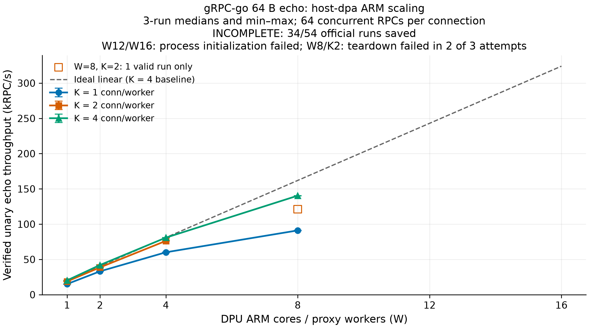

# gRPC-go 64B echo: host-dpa ARM core scaling — 2026-09-26

**총 18조건 중 11조건에서 각 3회 측정했다.** 유효 공식 측정은 34/54회, 측정 구간 완료 RPC는 19,702,835건이다. Bundle 상태는 **INCOMPLETE**이며 별도 진단 0조건은 아래 공식 수치에서 제외한다.

유효 결과는 모든 응답의 64B payload, connection별 native dial 1회, RPC 오류·재연결 0건, worker 간 동일한 10초 측정 구간을 통과한 실행이다. 미측정·실패 조건은 N/A로 남겼으며 0 RPC/s로 계산하지 않았다.

**8코어·2 conn/core는 총 3회 시도 중 1회만 정상 종료까지 통과했다.** 최초 실행과 새 proxy의 두 번째 실행은 RPC 오류·재연결 없이 10초 측정을 마친 뒤 native 연결 종료에서 EBADMSG(`bad message`)를 반환했다. 두 실패는 공식 처리량에서 제외했다. 성공한 121,146.1 RPC/s는 단일 참고값이다. **12·16코어는 각 K 모두 DPA process 생성 단계에서 실패하여 처리량이 없다.**

## 처리량과 지연

`host-dpa` reverse path, gRPC-go unary raw-codec echo다. **K는 ARM worker당 client connection 수이며 connection마다 동시 RPC 64개**다. Backend pool도 K개이며 전체 client connection은 W×K, 동시 RPC는 64×W×K다. W8/K2는 총 3회 시도 중 정상 종료까지 통과한 1회의 참고값이며 3회 중앙값으로 취급하지 않는다.

| ARM W | Conn/core K | 유효/예정 | RPC/s 중앙값 | RPC/s 최소–최대 | 최대 worker p99 중앙값 (ms) |
| --- | --- | --- | --- | --- | --- |
| 1 | 1 | 3/3 | 15,029.3 | 14,763.3–15,164.1 | 6.430 |
| 1 | 2 | 3/3 | 18,741.3 | 18,653.4–18,776.6 | 10.723 |
| 1 | 4 | 3/3 | 20,251.0 | 20,189.4–20,284.4 | 16.965 |
| 2 | 1 | 3/3 | 33,103.1 | 33,075.6–33,483.8 | 6.310 |
| 2 | 2 | 3/3 | 38,674.8 | 38,638.7–38,690.5 | 11.428 |
| 2 | 4 | 3/3 | 42,023.9 | 41,861.8–42,092.0 | 15.918 |
| 4 | 1 | 3/3 | 60,106.6 | 59,781.5–60,210.1 | 7.912 |
| 4 | 2 | 3/3 | 76,266.2 | 76,101.4–76,277.1 | 12.464 |
| 4 | 4 | 3/3 | 80,864.2 | 80,849.5–81,045.8 | 17.841 |
| 8 | 1 | 3/3 | 91,107.8 | 90,731.1–91,314.9 | 12.407 |
| 8 | 2 | 1/3 | 121,146.1 | 121,146.1–121,146.1 | 18.115 |
| 8 | 4 | 3/3 | 140,389.6 | 140,072.9–140,521.7 | 26.092 |
| 12 | 1 | 0/3 | N/A | N/A | N/A |
| 12 | 2 | 0/3 | N/A | N/A | N/A |
| 12 | 4 | 0/3 | N/A | N/A | N/A |
| 16 | 1 | 0/3 | N/A | N/A | N/A |
| 16 | 2 | 0/3 | N/A | N/A | N/A |
| 16 | 4 | 0/3 | N/A | N/A | N/A |

지연은 **반복마다 worker별 p99 중 최댓값을 구한 뒤 반복 중앙값을 취했다. 전체 RPC의 pooled p99가 아니다.** Worker별 평균/p50/p99와 반복별 수치는 JSON에 보존했다.

## CPU 사용률과 해석

100%는 CPU 한 개의 사용량이다. Worker CPU는 같은 dmesh-shard 이름을 상속한 helper도 합산한다. ARM 두 범위 열은 해당 조건의 모든 유효 CPU 표본과 모든 worker/core의 최소–최대다. Host 열은 8개 core pool 전체의 **실제 /proc/stat busy 중앙값 [반복 최소–최대]**다. Busy=(total−idle−iowait)/total이며 user에 포함된 guest 시간을 중복 합산하지 않는다. Process CPU 합계/8과 다른 지표다.

| W | K | Worker+helper CPU (%) | ARM core busy (%) | Host client pool busy (%) | Host server pool busy (%) |
| --- | --- | --- | --- | --- | --- |
| 1 | 1 | 100.00–100.00 | 100.00–100.00 | 19.42 [19.16–20.29] | 19.82 [19.31–20.19] |
| 1 | 2 | 100.00–100.10 | 99.90–100.00 | 21.78 [21.67–23.67] | 22.13 [22.02–22.18] |
| 1 | 4 | 99.90–100.00 | 100.00–100.00 | 22.69 [22.61–24.12] | 22.61 [22.51–22.71] |
| 2 | 1 | 99.90–100.10 | 99.90–100.00 | 41.03 [40.86–41.50] | 41.03 [40.85–41.61] |
| 2 | 2 | 99.90–100.00 | 100.00–100.00 | 43.32 [43.11–43.45] | 43.78 [43.73–43.79] |
| 2 | 4 | 99.90–100.00 | 100.00–100.00 | 35.12 [35.02–35.18] | 36.89 [36.85–36.98] |
| 4 | 1 | 99.89–100.10 | 99.90–100.00 | 71.01 [70.96–71.52] | 70.33 [70.07–70.35] |
| 4 | 2 | 99.90–100.03 | 99.90–100.00 | 65.39 [64.98–65.98] | 64.99 [64.92–65.14] |
| 4 | 4 | 99.90–100.10 | 100.00–100.00 | 63.93 [63.92–64.90] | 63.22 [63.21–63.81] |
| 8 | 1 | 99.88–100.11 | 99.90–100.00 | 89.76 [89.64–89.79] | 89.64 [89.52–89.71] |
| 8 | 2 | 99.90–100.00 | 100.00–100.00 | 91.04 [91.04–91.04] | 90.11 [90.11–90.11] |
| 8 | 4 | 99.87–100.10 | 99.90–100.00 | 91.60 [91.51–91.62] | 90.23 [90.09–90.35] |
| 12 | 1 | N/A | N/A | N/A | N/A |
| 12 | 2 | N/A | N/A | N/A | N/A |
| 12 | 4 | N/A | N/A | N/A | N/A |
| 16 | 1 | N/A | N/A | N/A | N/A |
| 16 | 2 | N/A | N/A | N/A | N/A |
| 16 | 4 | N/A | N/A | N/A | N/A |

`DMESH_BUSY_POLL=1`이므로 ARM core 사용률이 100%라는 사실만으로 RPC 처리 연산 포화를 판단하지 않는다. 전체 시스템이 동일한 DMA/PCIe/DPA 자원을 공유하며 host의 CPU 예산은 모든 W에서 8+8개로 고정된다. 따라서 이 결과에서 ARM만의 병목을 분리해 확정할 수 없다. W=16은 DPU worker가 CPU0–15를 모두 사용하여 controller/mock(CPU0–3), OS 및 다른 작업과 겹친다. CPU tick과 표본 경계 때문에 100% 부근의 작은 초과·편차가 생길 수 있다. schedstats가 꺼진 표본의 runqueue wait=null은 대기시간 0을 뜻하지 않는다.

## 기존 dpu-dma 수치와의 참조 비교

아래는 같은 W/K, 64B, connection당 동시 RPC 64, 3회 반복을 맞춘 **host-dpa 중앙값 / 기존 dpu-dma 중앙값**과 증감률이다. 각각 3회 유효 결과가 있는 조합만 비교했다. **자원 배치가 달라 reverse mode만 바꾼 통제 비교는 아니다.** 이번 host-dpa는 host VHCA0에 EU95개, DPU에 나머지95개를 배정했다. 기존 dpu-dma suite는 다른 partition에 EU72개가 예약되어 DPU 잔여118개 조건이었다. 같은 production 바이너리라도 측정 시점의 시스템 부하 및 DPA process 구성도 다르다.

| ARM W | K=1: 비율 (증감) | K=2: 비율 (증감) | K=4: 비율 (증감) |
| --- | --- | --- | --- |
| 1 | 1.177× (+17.7%) | 1.111× (+11.1%) | 1.048× (+4.8%) |
| 2 | 1.203× (+20.3%) | 1.081× (+8.1%) | 1.045× (+4.5%) |
| 4 | 1.074× (+7.4%) | 1.088× (+8.8%) | 1.023× (+2.3%) |
| 8 | 1.024× (+2.4%) | N/A | 1.012× (+1.2%) |
| 12 | N/A | N/A | N/A |
| 16 | N/A | N/A | N/A |

[기존 dpu-dma 보고서](2026-09-26_grpc-go-64b-arm-scaling.md), 비교 입력 JSON: `bench-results/2026-09-26_grpc-go-64b-arm-scaling.json`.

별도 dpu-dma W16/K4 재실험은 partition 0개, DPU에서 전체190 EU를 사용할 수 있는 조건의 200,568.6 RPC/s다. 위 기존 suite 비율 표와 섞지 않았다. [Partition 해제 후 별도 결과](2026-09-26_grpc-go-64b-w16-k4-no-eu-partitions.md).

## 미측정·실패 조건

아래 stage는 runner에서 실패를 기록한 단계다. **이 표는 근본 원인을 판정하지 않는다.** W 전체의 시작 실패는 K=전체로 표시했다. 여러 실패 기록은 모두 보존했으며, 측정 전 실패와 측정 후 종료 실패는 classification 및 measurement_started/measurement_completed 필드로 구분한다.

| W | K | 기록 수 | 실패 stage | 로그 |
| --- | --- | --- | --- | --- |
| 8 | 2 | 2 | client_repeat | `/tmp/dmesh-grpc-host-dpa-scale-20260926/w8-k2-r1.log`, `/tmp/dmesh-grpc-host-dpa-scale-20260926/retry-w8-k2/w8-k2-r2.log` |
| 12 | 1 | 1 | client_repeat | `/tmp/dmesh-grpc-host-dpa-scale-20260926/w12-k1-r1.log` |
| 12 | 2 | 1 | client_repeat | `/tmp/dmesh-grpc-host-dpa-scale-20260926/w12-k2-r1.log` |
| 12 | 4 | 1 | client_repeat | `/tmp/dmesh-grpc-host-dpa-scale-20260926/w12-k4-r1.log` |
| 16 | 1 | 1 | host_ready | `/tmp/dmesh-grpc-host-dpa-scale-20260926/w16/w16-k1-ready.log` |
| 16 | 2 | 1 | host_ready | `/tmp/dmesh-grpc-host-dpa-scale-20260926/w16/w16-k2-ready.log` |
| 16 | 4 | 1 | host_ready | `/tmp/dmesh-grpc-host-dpa-scale-20260926/w16/w16-k4-ready.log` |

실패 메타데이터: `/tmp/dmesh-grpc-host-dpa-scale-20260926/failures.json`에 오류 원문·정리 결과·로그 경로가 있다.

12코어는 DPU context 12개 + host server 12개 + host client 4개 = 28개까지 생성되고, 나머지 client 8개의 생성이 실패했다. 16코어는 DPU 16개 + host server 12개 = 28개까지 생성되고 나머지 server 4개가 실패했다. **K=1/2/4 모두 같은 경계**를 확인했다. 필요한 DPA process 수는 3W이므로 W12는 36개, W16은 48개이며 장치의 max_processes=28을 넘는다. Firmware의 create-process Status 0xf는 로컬 mlx5 헤더의 NO_RES_ERR와 일치한다. Syndrome 0x269a7e의 세부 의미를 별도로 해독한 것은 아니며, 성공 수 28개와 반복된 자원 부족 오류를 근거로 process 한도에 도달한 것으로 판단한다. status-w16-startup query의 processes=16 값은 전체 28개를 직접 보고한 값으로 해석하지 않았다. 조건별 생성 성공/실패 집계: `/tmp/dmesh-grpc-host-dpa-scale-20260926/process-limit-observations.json`.

EU도 별도의 제약이다. 현재 per-flow thread 구조에서는 host/DPU 각각 2WK개, 합계 4WK개가 필요하다. W12/K4는 192개, W16/K4는 256개이므로 process 구성을 바꾸더라도 칩의 총 190 EU를 초과한다. 이번 W12/W16의 실제 선행 실패는 DPA process 생성 오류다.

W8/K2의 두 EBADMSG는 benchmark의 deferred cleanup에서 결과 OK=false로 반영됐다. payload mismatch이면 RPC 오류 카운터와 별도의 payload mismatch 문구가 기록되는 코드이며, 이번 두 실행은 RPC 오류 0이었다. 최초 실패는 worker0, 재시도 실패는 worker2였다. 정확한 native close 하위 실패 분기는 저장 로그만으로 확정하지 않았다. 한 번의 성공으로 종료 안정성이 확인됐다고 보지 않는다. 3회 시도와 실패 보존 기록: `/tmp/dmesh-grpc-host-dpa-scale-20260926/retry-accounting.json`.

## 재현 조건과 DPA 자원

- 요청/응답 각각 application payload 64B, gRPC-go unary raw-codec echo. HTTP/2·gRPC framing은 별도이며 protobuf 직렬화와 POSIX preload는 사용하지 않았다. Warmup 3초, 측정 10초, RPC timeout 5초다.
- W개 client process와 W개 server process를 각각 DPUMesh{i}에 연결한다. Worker별 service는 10.0.1.(i+1):8086, backend initial pool/max는 K다. 모든 client의 preflight 후 공통 미래 시작 시각을 파일로 게시하며 동일한 측정 구간에 완료된 RPC만 합산한다.
- DPU worker i는 ARM CPU15−i에 고정한다. DMESH_SHARDED=1, DMESH_NUM_WORKERS=W, LINKERD2_PROXY_CORES=1, DMESH_BUSY_POLL=1. Host client는 CPU0–7, server는 CPU8–15를 공유하고 각 process는 GOMAXPROCS=8이다.
- Host reverse DPA는 PCI 0b:00.0/VHCA0, Comch는 host PCI 0b:00.1, DPU는 PCI 03:00.1/VHCA4를 사용한다.
- Chip EU는 190개다. 임시 partition ID1는 VHCA0에 EU0-94(95개)를 배정하며 DPU 쪽 잔여는 95개다. DPA core/EU는 ARM CPU와 다른 자원이다.
- DPU thread 객체를 worker당 32개 미리 만든다. 목표 active DPA thread는 host/DPU 각각 2WK개, DPA process는 host 2W + DPU W = 3W개다. Chip query의 max_processes는 28개다. 이는 자원 요구량 설명이며 개별 실패 원인은 해당 로그와 따로 대조해야 한다.
- Production transport/proxy 및 fixture 바이너리는 이전 측정과 같다. 이번 변경은 임시 harness와 EU 배치이며 정상 native teardown을 우회하지 않았다. 각 반복의 client를 새로 띄우고 조건의 server는 반복 동안 유지한다. W1은 기존 runner의 mode/path 변경본으로 수행했고 이후는 실패 기록을 보강한 runner를 사용했다. 실패한 server의 exit를 즉시 기록하도록 임시 host supervisor의 reap를 병렬화했다. 측정 구간과 부하 설정은 동일하다.

## 정리와 partition 복원

보존된 host server 종료 기록 137개(exit 0: 125개, exit 1: 12개), DPU 세션 stop-result 성공 7/7개, proxy exit 0: 7개. 초기화 실패로 종료한 서버와 정상 측정을 끝낸 서버의 exit는 구분한다. Runner 최종 이벤트의 cleanup_failed는 모두 false다.

임시 partition을 제거하고 **시작 상태인 partition 0개로 복원했다.** 종료 query에서 root group 0개, DPA process 0개를 확인했다. 복원 기록: `/tmp/dmesh-grpc-host-dpa-scale-20260926/partition-restored.json`, 종료 상태: `/tmp/dmesh-grpc-host-dpa-scale-20260926/status-after.txt`.

## 자료와 바이너리 식별

전체 원본·실패·스크립트 압축 아카이브: `bench-results/2026-09-26_grpc-go-64b-host-dpa-arm-scaling-raw.tar.gz`.

- 원본·검증·집계 JSON: `bench-results/2026-09-26_grpc-go-64b-host-dpa-arm-scaling.json`
- [반복별 CSV](2026-09-26_grpc-go-64b-host-dpa-arm-scaling.csv)
- 원본 results.json: `/tmp/dmesh-grpc-host-dpa-scale-20260926/results.json`, environment.json: `/tmp/dmesh-grpc-host-dpa-scale-20260926/environment.json`
- Runner·host·proxy·종료 원본 디렉터리: `/tmp/dmesh-grpc-host-dpa-scale-20260926`, 실험 및 분석 scripts: `/tmp/dmesh-grpc-host-dpa-scale-20260926/scripts`

자원 증거: chip-before.txt: `/tmp/dmesh-grpc-host-dpa-scale-20260926/chip-before.txt`, partition-before.txt: `/tmp/dmesh-grpc-host-dpa-scale-20260926/partition-before.txt`, status-before.txt: `/tmp/dmesh-grpc-host-dpa-scale-20260926/status-before.txt`, partition-during.txt: `/tmp/dmesh-grpc-host-dpa-scale-20260926/partition-during.txt`, partition-after.txt: `/tmp/dmesh-grpc-host-dpa-scale-20260926/partition-after.txt`, status-after.txt: `/tmp/dmesh-grpc-host-dpa-scale-20260926/status-after.txt`, partition-restored.json: `/tmp/dmesh-grpc-host-dpa-scale-20260926/partition-restored.json`.

| 바이너리 | SHA-256 |
| --- | --- |
| libdpumesh.so.5 | `727ec2ab5dc427140da2c5db9e9f1779a464d84d770f774d19febe84bdc651af` |
| channel-bench-scale | `f5c7b85e496e1d49f30d4633fdd1a776f2ac59921eb3244aa87f568b86c1589f` |
| linkerd2-proxy | `a25fa454bb30d25fcb1263653461beda13d756ddf6d5f03ff6339075a3764486` |
| dpa_kernel.a | `4c5b84fdd524dfee19d2e3b671bbac9518320ec377b5438382d603ad5a8b5e2f` |

집계에 사용한 raw results SHA-256: `b279db098599c101b8a1ff582acea55aef499b03ac5cdde68e95499dd3c64b00`. 이 보고서 입력 bundle SHA-256: `a8951e707d7a077088299b9d32043b8756ef6318311574932978882f7062b5c0`. Bundle 생성 시각: 2026-09-26T04:23:04.620011+00:00.

## 공개 자료의 범위

링크로 연결한 보고서·CSV·그림·작은 결과 JSON은 Git에 포함한다. 코드로 표시한 원본 경로는 Git 추적 대상이 아니며, `/tmp`는 실험 당시 경로라 현재 존재를 보장하지 않는다. 실제 로컬 보존 파일은 [자료 보존 안내](README.md#자료-보존)를 참조한다.
