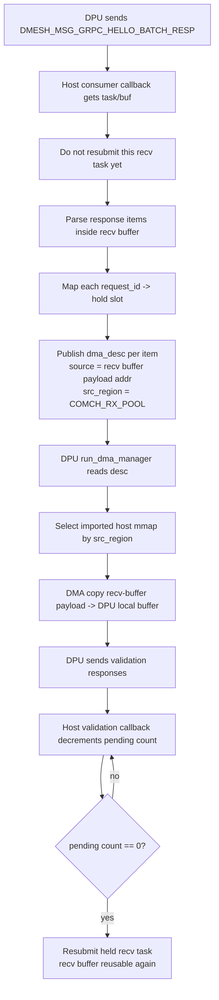

# gRPC Batch Response to DMA Source Zero-Copy Design

현재 `DPUMesh/DPUMesh` + `DPUMesh/gRPC`의 `DEMO_GRPC_OFFLOAD` 경로에서, Host는 batch response를 받은 뒤 response payload를 다시 host `dma_buffer` staging slot으로 복사하고 `dma_desc`를 publish한다. 이 문서는 그 추가 copy를 줄이기 위한 설계안이다.

분석 기준 파일:
- [comch_consumer.c](/home/jihoon/DPUMesh/DPUMesh/comch_consumer.c)
- [comch_producer.c](/home/jihoon/DPUMesh/DPUMesh/comch_producer.c)
- [buffer.c](/home/jihoon/DPUMesh/DPUMesh/buffer.c)
- [ring.c](/home/jihoon/DPUMesh/DPUMesh/ring.c)
- [ring.h](/home/jihoon/DPUMesh/DPUMesh/ring.h)
- [object.h](/home/jihoon/DPUMesh/DPUMesh/object.h)
- [dpa_common.h](/home/jihoon/DPUMesh/DPUMesh/dpa_common.h)
- [device/dpa_kernel.c](/home/jihoon/DPUMesh/DPUMesh/device/dpa_kernel.c)
- [comch_common.h](/home/jihoon/DPUMesh/DPUMesh/comch_common.h)
- [comch_msgq.c](/home/jihoon/DPUMesh/DPUMesh/comch_msgq.c)

## 1. 현재 copy가 필요한 이유

### 1.1 Comch receive buffer의 lifetime
Host consumer buffer pool은 [buffer.c](/home/jihoon/DPUMesh/DPUMesh/buffer.c) 의 `init_local_mem_bufs()`에서 `CC_DATA_PATH_TASK_NUM * CC_DATA_PATH_MAX_MSG_SIZE` 크기의 연속 메모리로 만들어진다. 이 메모리는 `doca_buf_pool`의 backing memory이고, [comch_consumer.c](/home/jihoon/DPUMesh/DPUMesh/comch_consumer.c) 의 `prepare_consumer_tasks()`가 각 `doca_buf`를 `doca_comch_consumer_task_post_recv_alloc_init()`로 묶어 미리 post 한다.

문제는 completion callback이다.

- [comch_consumer.c](/home/jihoon/DPUMesh/DPUMesh/comch_consumer.c) 의 `consumer_recv_task_comp_cb()`는
  - `doca_comch_consumer_task_post_recv_get_buf(task)`로 같은 `doca_buf`를 얻고
  - `doca_buf_get_data(buf, &recv_msg)`로 payload pointer를 읽은 뒤
  - callback 끝에서 같은 task를 다시 `doca_task_submit()`한다.

즉, **현재 receive payload pointer는 callback이 끝나고 task가 resubmit되면 더 이상 안정적인 source buffer가 아니다.** 다음 Comch message가 같은 buffer slot을 덮어쓸 수 있다.

### 1.2 DPA DMA thread는 source address를 비동기적으로 참조한다
Host callback은 `dma_desc`를 ring에 publish하고 끝난다. 그 후 DPU의 resident DPA thread는 [device/dpa_kernel.c](/home/jihoon/DPUMesh/DPUMesh/device/dpa_kernel.c) 의 `run_dma_manager()` -> `poll_desc_ring()`에서 descriptor를 비동기적으로 읽는다.

즉, source address는 다음 순서를 따른다.

1. Host callback이 source pointer를 descriptor에 기록
2. Host callback 반환
3. Comch receive task 재사용 가능
4. DPA thread가 나중에 descriptor를 보고 source를 DMA read

이 순서 때문에, **Comch receive buffer를 그대로 descriptor source로 넘기려면 “task 재제출을 늦춰서 buffer lifetime을 연장”해야 한다.**

### 1.3 현재 `dma_buffer` staging이 안전한 이유
현재 구조는 payload를 host `dma_buffer`로 복사한 뒤, 그 주소를 descriptor source로 쓴다.

- `dma_buffer`는 [host_worker.c](/home/jihoon/DPUMesh/DPUMesh/host_worker.c) 에서 별도로 `alloc_buffer_and_set_mmap()`으로 할당된다.
- 이 메모리의 lifetime은 Comch task와 무관하다.
- descriptor slot이 비워질 때까지 host가 overwrite만 하지 않으면, DPA DMA thread는 안전하게 source를 읽을 수 있다.

즉 지금 copy는 성능상 낭비지만, **buffer ownership을 Comch task와 분리한다는 점에서 안전장치 역할**을 한다.

## 2. 옵션 비교

| Option | 아이디어 | DOCA/ownership 관점 | copy 제거 수준 | DPU 변경 | 난이도/위험 |
|---|---|---|---|---|---|
| A | 현재 Comch receive buffer를 그대로 DMA source로 사용, task는 즉시 resubmit | 사실상 불가. buffer lifetime이 callback 종료와 동시에 재사용 가능 상태가 되므로 race 발생 | 높음(이론상) | 적음 | 매우 높음 / 불안정 |
| B | Comch response receive task를 pin 하고, 해당 receive buffer를 DMA source로 직접 사용. validation 응답 후 task resubmit | 가능. lifetime을 host가 명시적으로 관리해야 함 | 높음 | 중간 | 중간 / 현실적 |
| C | batch response payload 자체를 Comch로 보내지 않고, DPU가 host-exported response pool에 직접 써 넣고 Comch로는 metadata만 보냄 | 가능하지만 프로토콜과 DPU-side write path를 새로 만들어야 함 | 매우 높음 | 큼 | 높음 / 장기적으로 우수 |
| D | 지금처럼 별도 staging pool을 유지하되, allocator/pool만 더 정교화 | 가능. 하지만 copy 자체는 남음 | 낮음 | 적음 | 낮음 / 효과 제한 |

### Option A: 현재 receive buffer 직접 재사용, task 즉시 resubmit
이 옵션은 구조적으로 배제하는 것이 맞다.

- receive buffer는 callback 끝에서 다시 Comch에 반환된다.
- DPA DMA는 비동기라 source 읽기 시점이 늦다.
- 따라서 **같은 buffer가 다음 batch response나 validation response로 덮어써질 수 있다.**

결론:
- 현재 DOCA Comch receive task lifecycle을 유지한다면 사실상 불가
- 이 옵션은 설계 후보로 남길 가치가 없다

### Option B: response receive task pin + deferred resubmit
핵심 아이디어:
- batch response를 받은 receive task를 즉시 resubmit하지 않는다.
- 그 task가 들고 있던 `doca_buf`를 **DMA source staging buffer로 간주**한다.
- batch 내 각 encoded item에 대해 `dma_desc`를 publish하되, source address는 해당 receive buffer의 payload 내부를 직접 가리킨다.
- DPU validation response가 모두 도착하면 그때 receive task를 resubmit한다.

필요한 구조 변경:
- Host consumer callback이 batch response를 받았을 때
  - `task`, `buf`, base address, pending item count를 hold table에 저장
  - request_id -> hold slot 매핑을 만든다
- validation response 수신 시
  - request_id -> hold slot lookup
  - pending count 감소
  - 0이 되면 held receive task resubmit
- Host는 response receive buffer pool mmap을 DPU에 export 해야 한다
- DPU `run_dma_manager()`는 descriptor마다 source mmap을 선택할 수 있어야 한다

장점:
- host-side memcpy 제거 가능
- 기존 batch response, host DMA ring publish, DPU resident DMA manager, validation response 구조를 모두 유지
- Comch payload 형식도 유지 가능

위험:
- held receive task 수가 많아지면 consumer receive task 풀이 줄어든다
- 하지만 현재 `CC_DATA_PATH_TASK_NUM = 256`이고 demo는 batch response 1개당 hold task 1개라 충분히 관리 가능

### Option C: DPU가 host-exported response pool에 직접 기록, Comch는 metadata만 전송
핵심 아이디어:
- Host가 “response pool”과 free slot 관리 정보를 DPU에 export
- DPU ARM 또는 DPA가 encoded payload를 해당 host slot에 직접 기록
- Comch batch response는 `request_id/slot/len/status`만 전달
- Host는 그 metadata를 받아 ring에 publish

장점:
- host-side batch response payload copy가 완전히 사라진다
- Comch는 control/metadata plane으로 축소

필요한 구조 변경:
- 새로운 response-pool mmap export
- free slot allocator / recycle protocol
- DPU 쪽에서 host memory에 직접 write 하는 경로 추가
- batch response wire format 변경

리스크:
- 현재 코드 베이스에서 가장 invasive
- DPU->host write path 설계와 slot recycle 프로토콜이 필요

결론:
- 장기적으로는 가장 깔끔하지만, 현재 구조를 유지한 채 빠르게 들어가기에는 너무 크다

### Option D: 별도 staging pool 유지, allocator만 개선
핵심 아이디어:
- 현재 `dma_buffer` staging을 유지하되 slot allocator/flow control만 고도화
- copy는 남지만 wait cost를 더 줄인다

장점:
- 구현이 가장 쉽다
- 현재 코드와 충돌이 적다

한계:
- 질문의 핵심인 payload copy 제거에는 미달한다

결론:
- fallback 최적화용이지, zero-copy 설계의 본안은 아니다

## 3. 최종 권장안

**권장안: Option B - “Pinned Comch response buffer as DMA source”**

이유:
1. 현재 코드의 기능을 가장 적게 흔들면서 host-side memcpy를 제거할 수 있다.
2. batch response를 계속 Comch로 받기 때문에 기존 응답/검증 흐름을 유지할 수 있다.
3. `run_dma_manager()`도 유지 가능하다. 다만 descriptor가 source region을 지정하게만 바꾸면 된다.
4. buffer lifetime 문제를 “task resubmit 지연”이라는 명확한 ownership 규칙으로 해결할 수 있다.
5. Option C보다 훨씬 덜 invasive하다.

## 4. 권장 아키텍처

## 5. 구현 계획

### 5.1 구조체/메모리 변경

#### `object.h`
다음 상태가 추가되어야 한다.

- response receive hold table
  - `struct demo_rx_hold {`
  - `    struct doca_comch_consumer_task_post_recv *task;`
  - `    struct doca_buf *buf;`
  - `    uint8_t *base;`
  - `    uint32_t pending_count;`
  - `    bool in_use;`
  - `};`
- `request_id -> hold slot` 매핑 테이블
- host consumer pool mmap의 imported/export state
- `doca_dpa_dev_mmap_t`는 host에서 구하는 값이 아니라, **DPU가 import한 remote mmap handle** 쪽으로 관리하는 편이 맞다

#### `comch_common.h`
다음이 필요하다.

- `enum mmap_type`에 새 종류 추가
  - 예: `DMA_COMCH_RX_POOL = 3`
- 필요 시 `enum dma_src_region`
  - `DMA_SRC_HOST_STAGE = 1`
  - `DMA_SRC_COMCH_RX_POOL = 2`

#### `dpa_common.h`
현재 `dma_desc`는 `mmap`, `addr`, `size`, `idx`, `valid`가 있지만 DPA kernel은 실제로 `desc->mmap`를 쓰지 않고 `thread_arg->host_mmap`만 사용한다.

권장 변경:
- `dma_desc`에 `src_region` 추가
- `desc->addr`는 exported host mmap 내부 주소 유지
- DPA kernel이 `src_region`에 따라 source mmap을 고르게 한다

또는 기존 `mmap` 필드를 의미적으로 재정의해서 “region id”로 써도 되지만, 이름이 혼동을 만든다. 필드 분리가 낫다.

#### `dpa_thread_arg`
다음 imported host mmap handle이 추가되어야 한다.

- 기존 `host_mmap` : 기존 host `dma_buffer` staging용
- 신규 `comch_rx_pool_mmap` : host consumer pool export용

### 5.2 Host에서 export할 메모리
현재 host는 [ring.c](/home/jihoon/DPUMesh/DPUMesh/ring.c) 에서 ring mmap, [host_worker.c](/home/jihoon/DPUMesh/DPUMesh/host_worker.c) 에서 `dma_buffer` mmap만 export 한다.

권장 변경:
- host consumer pool mmap (`objs->consumer_mem->mmap`)도 export
- 이 export는 consumer init 이후 가능하다
- 새 control-path message type 또는 기존 `DMESH_MSG_EXPORT_DESC` + 새 `mmap_type`로 전달

### 5.3 Comch receive callback 변경
현재 [comch_consumer.c](/home/jihoon/DPUMesh/DPUMesh/comch_consumer.c) 의 `consumer_recv_task_comp_cb()`는 callback 끝에서 무조건 task를 resubmit한다.

권장 변경:
- message type이 `DMESH_MSG_GRPC_HELLO_BATCH_RESP`인 경우:
  1. `task`와 `buf`를 hold table에 저장
  2. response payload 내부 각 encoded item의 absolute source address 계산
  3. 각 item에 대해 `dma_desc` publish
  4. **즉시 resubmit하지 않고 return**
- message type이 validation response 등 다른 메시지인 경우:
  - 기존처럼 즉시 resubmit

### 5.4 request_id -> hold slot release
validation response는 이미 request_id를 싣고 온다.

권장 변경:
- batch response를 publish할 때, 각 request_id를 같은 hold slot에 매핑
- validation response callback에서 request_id lookup
- 해당 hold slot의 `pending_count--`
- `pending_count == 0`이면 held `task`를 다시 `doca_task_submit()`

이 방식의 장점:
- DPU DMA copy 완료 및 validation 완료를 host가 release signal로 그대로 재사용할 수 있다
- 별도 host ack 메시지를 새로 만들 필요가 없다

### 5.5 DPU `run_dma_manager()` 변경
현재 [device/dpa_kernel.c](/home/jihoon/DPUMesh/DPUMesh/device/dpa_kernel.c) 의 `poll_desc_ring()`는 source mmap으로 항상 `thread_arg->host_mmap`만 사용한다.

권장 변경:
- descriptor의 `src_region` 또는 유사 필드를 읽는다
- `host_stage`면 기존 `thread_arg->host_mmap`
- `comch_rx_pool`면 신규 `thread_arg->comch_rx_pool_mmap`
- 나머지 로직은 그대로 유지한다

즉, `run_dma_manager()` 자체는 유지되며 source mmap 선택만 일반화된다.

### 5.6 validation path 영향
validation path는 큰 변경이 없다.

- DPU는 여전히 DMA completion 뒤 validation response를 보낸다
- Host는 validation response를 받으면
  - 기존 실패/성공 bookkeeping 유지
  - 추가로 held recv task release에도 사용

즉 validation response가 “기능 검증”과 “receive buffer release ack” 역할을 동시에 하게 된다.

## 6. 단계별 migration plan

### Phase 1: source region 다중화
- `mmap_type` 확장
- host consumer pool mmap export 추가
- DPU `process_mmap_msg()`에 `DMA_COMCH_RX_POOL` 처리 추가
- `dpa_thread_arg`에 imported mmap handle 추가
- `dma_desc`에 `src_region` 추가
- `run_dma_manager()`에서 source mmap 선택 지원

### Phase 2: host response buffer pinning
- `consumer_recv_task_comp_cb()`에서 batch response task hold
- hold table + request_id->hold slot map 추가
- validation response로 held task release

### Phase 3: copy-free publish path 활성화
- `handle_demo_grpc_batch_resp()`가 payload memcpy 대신
  - response buffer 내부 address를 직접 descriptor source로 기록
- 기존 `dma_buffer` staging path는 fallback으로 남겨 둘 수 있다

### Phase 4: flow control hardening
- held response tasks 최대 개수 제한
- task starvation 시 fallback copy path 사용 여부 결정
- timeout/cleanup path 정리

## 7. 왜 이 안이 현재 코드베이스에서 가장 현실적인가

- Comch payload 형식을 바꾸지 않는다
- Host가 이미 validation response를 받으므로, release signal을 새로 만들 필요가 없다
- batch response 수신, DMA ring publish, DPU resident DMA manager, validation response를 모두 유지한다
- 바꾸는 핵심은 “receive task lifetime”과 “source mmap 선택” 두 군데로 국한된다

반면 Option C는 장기적으로 더 좋은 구조이지만,
- 새로운 response staging protocol
- DPU->host direct placement path
- slot recycle protocol
을 새로 설계해야 하므로 현재 코드 기준으로는 과하다.

## 8. 남는 한계

1. 이 설계는 **host-side batch response payload memcpy**는 제거하지만, DPU가 batch response를 Comch producer buffer로 만들 때의 복사는 그대로 남는다.
2. held receive tasks가 많아지면 consumer receive capacity가 줄어든다.
3. DPU validation response가 release ack 역할을 겸하므로, validation이 늦으면 buffer release도 늦어진다.

즉, 이 설계는 현재 ask에 가장 잘 맞는 “실용적 zero-copy 근사”이고, **완전한 end-to-end zero-copy는 Option C 수준의 protocol redesign이 필요**하다.
